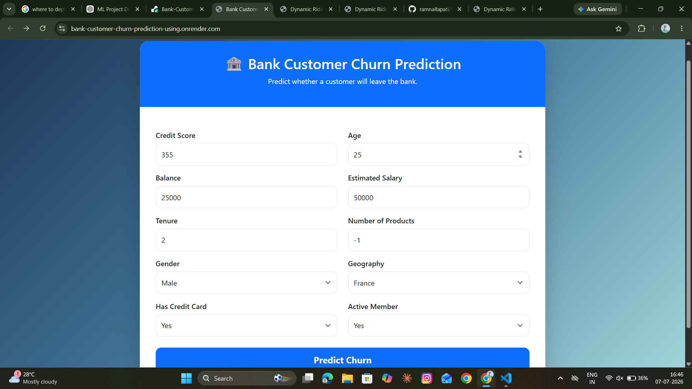

## Bank Customer Churn Prediction

[Live Link URL](https://bank-customer-churn-prediction-using.onrender.com/)

---

### Home Page Output
<p align="center">
    
</p>


# 🚀 Bank Customer Churn Prediction

> Predicting whether a customer stay with Bank or Leaving a Bank.

<p align="center">
  
</p>

<p align="center">
  
  
  
  
  
  
  
  
</p>

---

# 📌 Overview

Developed a **Bank Customer Churn Prediction** system using **Python, Scikit-learn, and XGBoost** to identify customers at risk of leaving the bank based on demographic, financial, and behavioral data. Performed data preprocessing, exploratory data analysis, feature engineering, and trained multiple machine learning models, selecting the best-performing model using classification metrics. Achieved strong predictive performance using **Accuracy, Precision, Recall, F1-Score, and ROC-AUC**, enabling proactive customer retention strategies and data-driven business decisions.


---

# 🎯 Objectives

The objective of this project is to predict whether a bank customer is likely to churn based on customer demographics, account information, and transaction behavior using machine learning techniques. The solution helps banks identify at-risk customers early, enabling targeted retention strategies, reducing customer attrition, and improving overall business profitability.


---

# ✨ Features

- Data preprocessing
- Exploratory Data Analysis
- Feature Engineering
- Model Training
- Hyperparameter Tuning
- Model Evaluation
- Prediction on New Data
- Visualization
- Deployment Ready

---

# 📂 Project Structure

```text
bank-churn-prediction
│
├── app.py
├── best_model.pkl
├── Churn_Modelling (2).csv
├── customer-churn-prediction.ipynb
├── preprocessor.pkl
├── Procfile
├── README.MD
├── requirements.txt
├── transformed_test.csv
├── transformed_train.csv
│
├── catboost_info/
├── images/
├── static/
└── templates/
```

---

# 📊 Dataset

## Source

[Link}(https://www.kaggle.com/)


## Description

Developed an end-to-end **Bank Customer Churn Prediction** system using Python and machine learning to identify customers likely to leave the bank. Performed data preprocessing, feature engineering, model training, and evaluation, then deployed the best-performing model as a Flask web application for real-time churn prediction.


## Number of Samples

- Training Images
    - Rows : **8000**
    - Cols : **10**
- Test Images
    - Rows : **2000**
    - Cols : **10**

## Features

| Feature             | Description                                                                                |
| ------------------- | ------------------------------------------------------------------------------------------ |
| **RowNumber**       | Unique row identifier for each customer record.                                            |
| **CustomerId**      | Unique identification number assigned to each customer.                                    |
| **Surname**         | Customer's last name (primarily used for identification).                                  |
| **CreditScore**     | Customer's credit score indicating creditworthiness.                                       |
| **Geography**       | Country where the customer is located (e.g., France, Germany, Spain).                      |
| **Gender**          | Customer's gender (Male or Female).                                                        |
| **Age**             | Customer's age in years.                                                                   |
| **Tenure**          | Number of years the customer has been with the bank.                                       |
| **Balance**         | Current account balance maintained by the customer.                                        |
| **NumOfProducts**   | Number of bank products or services used by the customer.                                  |
| **HasCrCard**       | Indicates whether the customer owns a credit card (1 = Yes, 0 = No).                       |
| **IsActiveMember**  | Indicates whether the customer is an active bank member (1 = Yes, 0 = No).                 |
| **EstimatedSalary** | Estimated annual salary of the customer.                                                   |
| **Exited**          | Target variable indicating whether the customer left the bank (1 = Churned, 0 = Retained). |


## Target

**Exited** : Predicting whether the customer is stays with the Bank or Leaving the bank.

---

# 🛠 Tech Stack

- Python
- NumPy
- Pandas
- Matplotlib
- Scikit-learn
- TensorFlow / PyTorch
- OpenCV
- Jupyter Notebook

---

# ⚙ Installation

Clone the repository

```bash
git clone https://github.com/ramnallapati/Bank-Customer-Churn-Prediction-using-Flask.git
```

Move into the project

```bash
cd project
```

Install dependencies

```bash
pip install -r requirements.txt
```

---

# ▶ Usage

Run Application

```bash
python app.py
```

---

# 🔍 Exploratory Data Analysis

Include important plots such as:

- Distribution plots
- Correlation heatmap
- Missing values
- Class distribution
- Pair plots

Example:

```markdown

```

---

# ⚙ Feature Engineering

Explain:

- Missing value handling
- Encoding
- Scaling
- Feature Selection
- PCA (if used)

---

# 🧠 Model Architecture

Explain your model.

Example:

```
Input

↓

Data Augmentation

↓

EfficientNetB0

↓

Global Average Pooling

↓

Dropout

↓

Dense

↓

Softmax
```

For ML:

```
Input

↓

Preprocessing

↓

Random Forest

↓

Prediction
```

---

# 📈 Training

Example:

- Epochs: 20
- Batch Size: 32
- Optimizer: Adam
- Learning Rate: 0.001

---

# 📊 Results

| Metric | Score |
|---------|------:|
| Accuracy | 95% |
| Precision | 94% |
| Recall | 93% |
| F1 Score | 94% |

---

# 📷 Results

## Accuracy Curve

```markdown

```

## Loss Curve

```markdown

```

## Confusion Matrix

```markdown

```

## Sample Prediction

```markdown

```

---

# 🚀 Future Improvements

- More data
- Better model
- Hyperparameter tuning
- Model deployment
- Real-time inference
- Mobile application

---

# 🤝 Contributing

Contributions are welcome.

1. Fork the repository
2. Create a feature branch
3. Commit changes
4. Push the branch
5. Open a Pull Request

---

# 📄 License

This project is licensed under the MIT License.

---

# 👨‍💻 Author

**Ram Nallapati**

<p>
<a href="mailto:ramnallapati18@gmail.com">

</a>

<a href="https://github.com/YOUR_GITHUB_USERNAME">

</a>

<a href="https://www.linkedin.com/in/YOUR_LINKEDIN_USERNAME">

</a>
</p>

---

⭐ If you found this project useful, consider giving it a star!
